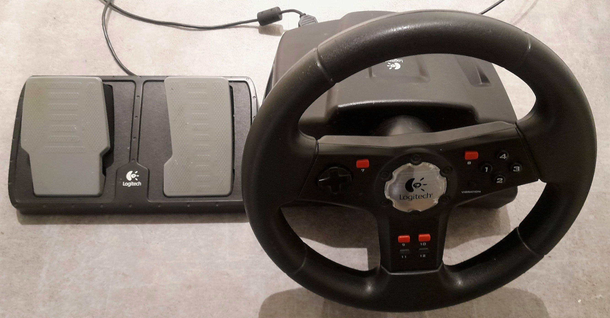

# Steering wheel publisher

It uses a Logitech racing wheel and its driver is here: https://github.com/berndporr/logitech_wheel



## Prerequisites

It compiles / runs under Ubuntu. Install the following packages:

```
apt install fastddsgen fastdds-tools libfastcdr-dev
```

## Compile

```
cmake .
make
```

## Run

```
./steering_wheel
```

and it will publish the throttle and steering angle.

## Credit

Bernd Porr
